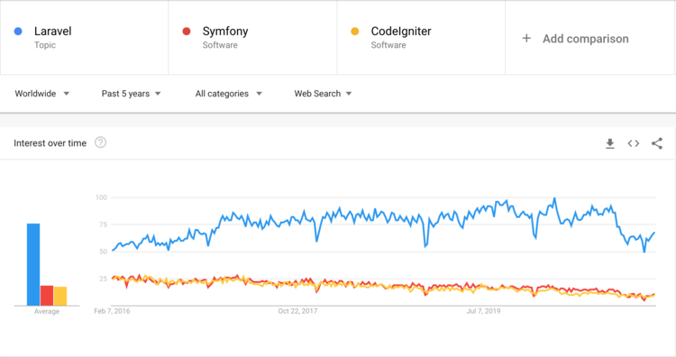
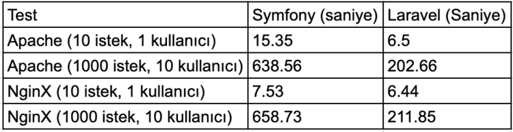
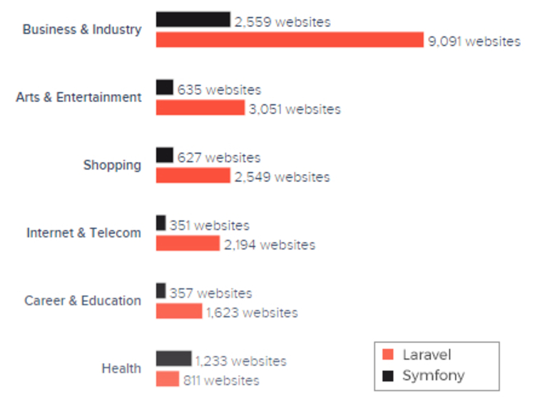
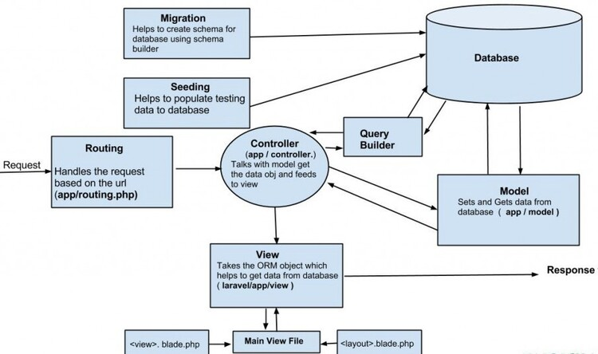
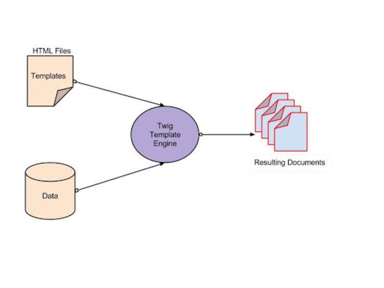

# Laravel Framework ve Symfony Framework Arasındaki Temel Farklar
## Endüstri İstatistikleri
Bugünün Google Trends verileri, Laravel’in son 5 yıldır en popüler PHP Framework olduğunu söylüyor.

Aynı zamanda Laravel'in Symfony'e oranla GitHub’daki popülaritesi de gözle görünür bir biçimde farkediliyor.

## Performans ve Ölçeklenebilirlik
Performans ve ölçeklenebilirlik, her web uygulamasının başarısının arkasındaki iki temel faktördür. Laravel, önbellek görünümleri için bir dizi birleşik API'ye sahipken, Symfony varsayılan olarak kaynak kodunu ve görünümleri önbelleğe alır. Symfony'nin daha uzun web sitesi yükleme süresine sahip olmasının nedeni budur.

Laravel'deki web siteleri için ortalama yükleme süresi yaklaşık 60 milisaniyedir, Symfony'nin yükleme süresi ise yaklaşık 250 milisaniyedir. Aşağıdaki resimde Symfony ve Laravel'in en büyük iki web sunucusu olan Apache ve NginX üzerindeki yükleme sürelerini görebilirsiniz.

Laravel, Symfony Bileşenlerine dayanmaktadır. Aynı zamanda Laravel, PHP programlamasını daha az kod ve daha yüksek performansla yapmanızı sağlar. Bir sonraki web uygulamanızı iş amaçlı oluşturmayı düşünüyorsanız, Laravel en iyi şekilde daha az kaynakla daha hızlı teslimat gerektiren projeler için çalışır.

Symfony ise projelerinizin başlangıç ​​aşamasında daha fazla zaman, kodlama çalışması ve finansal kaynak gerektirir. Ayrıca, öğelerini yapılandırmak için çok fazla çalışma gerektirir.

Ancak Symfony, karmaşık web projeleri için iyi bir seçimdir, çünkü özel işlevselliği iş web uygulamanızın gereksinimleri ile uyumludur.

## Modülerlik Standartları
Symfony, yeniden kullanılabilir bileşenlerden oluşan ince bir koleksiyonla birlikte gelen modüler bir yapının paketlenmiş formuna dayanmaktadır. Bu, bir web uygulaması geliştirirken daha iyi modülerlik sağlar.

Symfony Paketleri (FrameworkBundle, SecurityBundle, DebugBundle vb.), farklı uygulamalar arasında kod ve özellikleri paylaşmak için kullanılır.

Laravel'in mimarisi farklıdır. Web uygulamanızda hızlı değişiklikler yapmak istediğinizde daha kısıtlıdır. Dolayısıyla, uygulama modüllerindeki herhangi bir değişiklik, geliştiricilerin yalnızca o modülle değil, tüm kod birimiyle uğraşmaları gerektiği anlamına gelir.

Symfony’nin kodu düzenleme yeteneği, onu karmaşık web geliştirme projeleri için ideal bir seçim haline getirir. Bazı web geliştiricilerinin Laravel yerine Symfony'yi tercih etmesinin nedeni budur.

Şablon motoru söz konusu olduğunda, Symfony, kısa ve okunabilir şablonlar yazmanıza olanak tanıyan Twig şablon oluşturma motorunu kullanır.

Öte yandan Laravel, kodunun yeniden kullanılabilirliği nedeniyle web uygulamaları için Blade şablonlama motorunu kullanıyor. Ayrıca, Twig şablon motorunda olduğu gibi aynı işlevi iki kez tanımlamaya gerek yoktur.

Her iki çerçeve de MVC mimarisi üzerine inşa edilmiştir. Ancak sonuçta, Symfony kod modülerliği ve bileşenlerin yeniden kullanılabilirliği açısından hala en iyi seçimdir.
## Veritabanı Desteği
Veritabanı destek sistemi, geliştiricilerin verileri yönetmesine ve birden çok görevi kolaylıkla gerçekleştirmesine olanak tanıdığı için önemlidir. Bilgileri tek bir yazılım uygulamasında depolar, düzenler ve yönetir.

Web geliştirme projelerinde veritabanı destek sistemi kullanmak, iş operasyonlarında verimliliği artırır ve maliyetleri düşürür. Hem Symfony hem de Laravel, veri erişimi için ORM'yi (Object Relational Mapping - Nesneyle İlgili Haritalama) kullanır. Symfony ORM Doctrine'i kullanırken Laravel ORM veri işleme için Eloquent'i kullanır.

 
Symfony veritabanı geçişleri otomatiktir. Ancak geliştiricilerin verilen kodda belirli alanları tanımlaması gerekir. Öte yandan, Laravel veritabanı geçişlerini kullanır ve alanları tanımlamaya gerek yoktur.

ORM destekli veritabanları ile bu iki PHP çerçevesi, veri işlemeyi kolaylaştırır.

- Symfony, veritabanı desteği için birkaç seçenek daha sunar, örneğin:

  * MySQL
  * Oracle
  * Çiseleme
  * SQL Server
  * PostgreSQL
  * SQLite
  * SAP Sybase SQL Anywhere
  
- Laravel bunlardan sadece birkaçını destekler:

  * MySQL
  *  PostgreSQL
  * SQLite
  * QL Server
  
Bu seçeneklerle görebileceğiniz gibi Symfony, Laravel'den daha fazla veritabanını desteklemektedir. Bu nedenle, veri işleme ve veri yönetimi Symfony ile çok daha basit hale geldi. Ancak Laravel'in işlevselliği, hantal ve büyük kod bloklarından kaçmak için büyük bir fırsattır.

Laravel ayrıca sıkıcı, tekrarlayan görevler yerine web projelerinde zamandan ve emekten tasarruf etmenizi sağlar. Ortak görevleri kolaylaştırmaya yardımcı olan birçok önemli aracı destekler. Ayrıca kimlik doğrulama, kuyruklama, oturumlar, önbelleğe alma ve yönlendirme gibi işlevleri otomatikleştirir.

## Sonuç Olarak
Yukarıda bahsedilen noktalardan, hem Laravel hem de Symfony'nin özellik bakımından zengin olduğu açıktır. Her ikisi de çok çeşitli web geliştirme projelerinde kullanıma uygundur.

Laravel, geliştiriciler tarafından hızlı gelişimi, performansı ve hızı nedeniyle sıklıkla tercih edilmektedir. Symfony, karmaşık ve büyük boyutlu web uygulamalarının geliştirilmesi için uygundur.